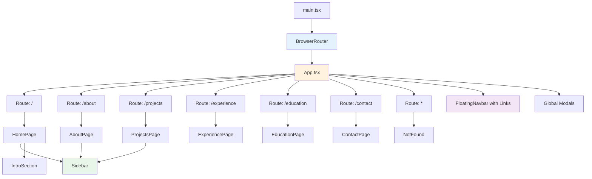
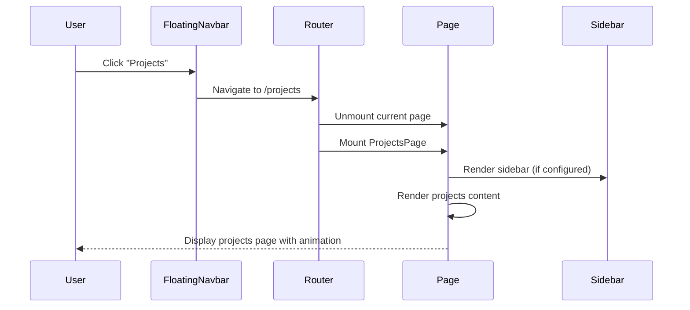
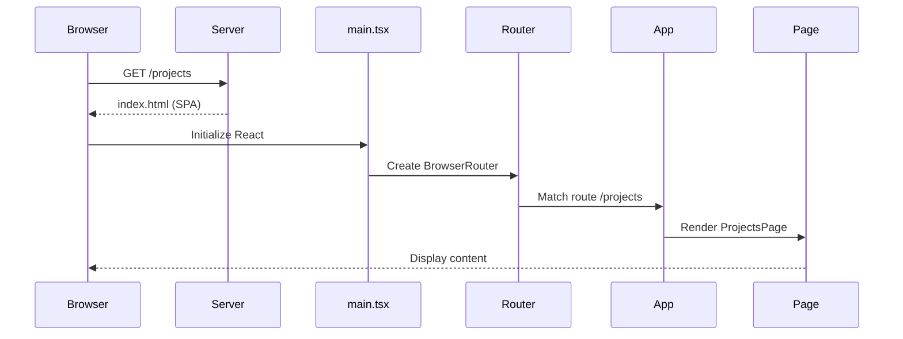

# Design Document: Multi-Page Routing System

## Overview

Transform the current single-page scroll-based portfolio into a multi-page application with client-side routing. The application currently uses scroll-spy navigation where all content sections (Home, Projects, Experience, Education, etc.) exist on a single page with smooth scrolling between sections. This design introduces React Router for proper page-based navigation while preserving the Material You design language, animations, and user experience. The key architectural change involves splitting the monolithic MainContent component into separate page components, modifying the FloatingNavbar to use Link components instead of scroll behavior, and configuring the build system for SPA routing support.

## Architecture



### Current vs. New Architecture

**Current (Single-Page)**:
- All sections in MainContent.tsx
- FloatingNavbar uses `scrollIntoView()` for navigation
- No routing library
- Single route: `/`

**New (Multi-Page)**:
- Separate page components for each section
- FloatingNavbar uses React Router `<Link>` components
- React Router manages navigation and history
- Multiple routes: `/`, `/about`, `/projects`, `/experience`, `/education`, `/contact`

## Sequence Diagrams

### Navigation Flow



### Initial Load Flow



## Components and Interfaces

### Component 1: Router Configuration (main.tsx)

**Purpose**: Initialize React Router and wrap the application

**Interface**:
```typescript
// main.tsx modifications
import { BrowserRouter } from 'react-router-dom';

function renderApp() {
  createRoot(document.getElementById('root')!).render(
    <StrictMode>
      <BrowserRouter>
        <App />
      </BrowserRouter>
    </StrictMode>
  );
}
```

**Responsibilities**:
- Wrap App component with BrowserRouter
- Handle OAuth callback routes (preserve existing logic)
- Initialize routing context for entire application

### Component 2: Route Definitions (App.tsx)

**Purpose**: Define all application routes and shared layout elements

**Interface**:
```typescript
import { Routes, Route, useLocation } from 'react-router-dom';

interface AppContentProps {
  // Existing props preserved
}

function AppContent() {
  const location = useLocation();
  
  return (
    <LayoutGroup>
      <div className="min-h-screen bg-background text-foreground">
        <AnimatePresence mode="wait">
          {isLoading && <WelcomePreloader onComplete={() => setIsLoading(false)} />}
        </AnimatePresence>

        <Routes>
          <Route path="/" element={<HomePage ready={!isLoading} />} />
          <Route path="/about" element={<AboutPage ready={!isLoading} />} />
          <Route path="/projects" element={<ProjectsPage ready={!isLoading} />} />
          <Route path="/experience" element={<ExperiencePage ready={!isLoading} />} />
          <Route path="/education" element={<EducationPage ready={!isLoading} />} />
          <Route path="/contact" element={<ContactPage ready={!isLoading} />} />
          <Route path="*" element={<NotFound />} />
        </Routes>

        <FloatingNavbar {...navbarProps} />
        {/* Global modals remain here */}
      </div>
    </LayoutGroup>
  );
}
```

**Responsibilities**:
- Define all application routes
- Manage global state (modals, auth, theme)
- Render shared components (FloatingNavbar, modals)
- Handle route transitions with AnimatePresence

### Component 3: Page Layout Wrapper

**Purpose**: Provide consistent layout structure for all pages

**Interface**:
```typescript
interface PageLayoutProps {
  children: React.ReactNode;
  showSidebar?: boolean;
  ready?: boolean;
}

export function PageLayout({ 
  children, 
  showSidebar = true, 
  ready = true 
}: PageLayoutProps) {
  return (
    <motion.div
      key={location.pathname}
      initial={{ opacity: 0, y: 20 }}
      animate={{ opacity: 1, y: 0 }}
      exit={{ opacity: 0, y: -20 }}
      transition={{ duration: 0.3 }}
      className="max-w-7xl mx-auto px-4 sm:px-6 lg:px-8 py-8 lg:py-12 pb-24"
    >
      <div className="flex flex-col lg:flex-row gap-8 lg:gap-14">
        {showSidebar && <Sidebar ready={ready} />}
        <main className="flex-1 min-w-0">
          {children}
        </main>
      </div>
    </motion.div>
  );
}
```

**Responsibilities**:
- Provide consistent page structure
- Handle page transition animations
- Conditionally render sidebar
- Apply responsive layout classes

### Component 4: Page Components

**Purpose**: Individual page components for each route

**Interface**:
```typescript
interface PageProps {
  ready?: boolean;
}

// HomePage - Landing page with intro
export function HomePage({ ready = true }: PageProps) {
  return (
    <PageLayout ready={ready} showSidebar={true}>
      <IntroSection />
      <PublicAnalytics />
    </PageLayout>
  );
}

// AboutPage - About section as standalone page
export function AboutPage({ ready = true }: PageProps) {
  return (
    <PageLayout ready={ready} showSidebar={true}>
      <AboutSection />
      <SkillsSection />
      <LanguagesSection />
    </PageLayout>
  );
}

// ProjectsPage - Projects showcase
export function ProjectsPage({ ready = true }: PageProps) {
  return (
    <PageLayout ready={ready} showSidebar={true}>
      <ProjectsSection />
    </PageLayout>
  );
}

// ExperiencePage - Work experience
export function ExperiencePage({ ready = true }: PageProps) {
  return (
    <PageLayout ready={ready} showSidebar={true}>
      <ExperienceSection />
      <TestimonialsSection />
    </PageLayout>
  );
}

// EducationPage - Education history
export function EducationPage({ ready = true }: PageProps) {
  return (
    <PageLayout ready={ready} showSidebar={true}>
      <EducationSection />
    </PageLayout>
  );
}

// ContactPage - Contact information
export function ContactPage({ ready = true }: PageProps) {
  return (
    <PageLayout ready={ready} showSidebar={false}>
      <ContactFullSection />
      <Footer />
    </PageLayout>
  );
}
```

**Responsibilities**:
- Render specific content for each route
- Use PageLayout for consistent structure
- Configure sidebar visibility per page
- Pass ready state for animation coordination

### Component 5: Modified FloatingNavbar

**Purpose**: Navigation bar using React Router Links instead of scroll behavior

**Interface**:
```typescript
import { Link, useLocation } from 'react-router-dom';

interface NavItem {
  id: string;
  path: string;
  icon: LucideIcon;
  label: string;
}

const navItems: NavItem[] = [
  { id: 'home', path: '/', icon: Home, label: 'Home' },
  { id: 'about', path: '/about', icon: User, label: 'About' },
  { id: 'projects', path: '/projects', icon: Briefcase, label: 'Projects' },
  { id: 'experience', path: '/experience', icon: Briefcase, label: 'Experience' },
  { id: 'education', path: '/education', icon: GraduationCap, label: 'Education' },
  { id: 'contact', path: '/contact', icon: Mail, label: 'Contact' },
];

export function FloatingNavbar(props: FloatingNavbarProps) {
  const location = useLocation();
  const activeItem = navItems.find(item => item.path === location.pathname)?.id || 'home';

  return (
    <motion.nav className="fixed bottom-6 left-0 right-0 z-40">
      <div className="flex items-center gap-2">
        {navItems.map((item) => (
          <Link
            key={item.id}
            to={item.path}
            className={`nav-item ${activeItem === item.id ? 'active' : ''}`}
          >
            <item.icon className="w-5 h-5" />
            <span>{item.label}</span>
          </Link>
        ))}
      </div>
    </motion.nav>
  );
}
```

**Responsibilities**:
- Replace scroll-based navigation with Link components
- Use `useLocation()` to determine active route
- Maintain existing visual design and animations
- Preserve theme toggle, chat, and profile buttons

## Data Models

### Route Configuration

```typescript
interface RouteConfig {
  path: string;
  component: React.ComponentType<PageProps>;
  showSidebar: boolean;
  label: string;
  icon: LucideIcon;
  showInNav: boolean;
}

const routes: RouteConfig[] = [
  {
    path: '/',
    component: HomePage,
    showSidebar: true,
    label: 'Home',
    icon: Home,
    showInNav: true,
  },
  {
    path: '/about',
    component: AboutPage,
    showSidebar: true,
    label: 'About',
    icon: User,
    showInNav: true,
  },
  {
    path: '/projects',
    component: ProjectsPage,
    showSidebar: true,
    label: 'Projects',
    icon: Briefcase,
    showInNav: true,
  },
  {
    path: '/experience',
    component: ExperiencePage,
    showSidebar: true,
    label: 'Experience',
    icon: Briefcase,
    showInNav: true,
  },
  {
    path: '/education',
    component: EducationPage,
    showSidebar: true,
    label: 'Education',
    icon: GraduationCap,
    showInNav: true,
  },
  {
    path: '/contact',
    component: ContactPage,
    showSidebar: false,
    label: 'Contact',
    icon: Mail,
    showInNav: true,
  },
];
```

**Validation Rules**:
- `path` must be unique and start with `/`
- `component` must be a valid React component
- `showSidebar` determines sidebar visibility
- `showInNav` controls whether route appears in navigation

### Navigation State

```typescript
interface NavigationState {
  currentPath: string;
  previousPath: string | null;
  isTransitioning: boolean;
}
```

## Algorithmic Pseudocode

### Main Routing Algorithm

```typescript
ALGORITHM initializeRouting()
INPUT: None
OUTPUT: Configured router with all routes

BEGIN
  // Step 1: Wrap application with BrowserRouter
  router ← createBrowserRouter()
  
  // Step 2: Define route configuration
  routes ← [
    { path: '/', element: HomePage },
    { path: '/about', element: AboutPage },
    { path: '/projects', element: ProjectsPage },
    { path: '/experience', element: ExperiencePage },
    { path: '/education', element: EducationPage },
    { path: '/contact', element: ContactPage },
    { path: '*', element: NotFound }
  ]
  
  // Step 3: Register routes with router
  FOR each route IN routes DO
    router.registerRoute(route.path, route.element)
  END FOR
  
  // Step 4: Configure history mode
  router.setHistoryMode('browser')
  
  RETURN router
END
```

**Preconditions**:
- React and ReactDOM are loaded
- react-router-dom is installed
- All page components are defined

**Postconditions**:
- Router is initialized with all routes
- Browser history API is configured
- Application is ready for navigation

### Navigation Handler Algorithm

```typescript
ALGORITHM handleNavigation(targetPath)
INPUT: targetPath of type string
OUTPUT: Navigation to target page with animation

BEGIN
  ASSERT targetPath starts with '/'
  
  // Step 1: Get current location
  currentPath ← location.pathname
  
  // Step 2: Check if navigation is needed
  IF currentPath = targetPath THEN
    RETURN // Already on target page
  END IF
  
  // Step 3: Start page transition
  setIsTransitioning(true)
  
  // Step 4: Trigger exit animation
  triggerExitAnimation(currentPath)
  
  // Step 5: Navigate to new route
  navigate(targetPath)
  
  // Step 6: Wait for route change
  AWAIT routeChanged()
  
  // Step 7: Trigger enter animation
  triggerEnterAnimation(targetPath)
  
  // Step 8: Complete transition
  setIsTransitioning(false)
  
  // Step 9: Track page view
  trackPageView(targetPath)
END
```

**Preconditions**:
- targetPath is a valid route path
- Router is initialized
- Navigation is not already in progress

**Postconditions**:
- User is navigated to target page
- Page transition animation completes
- Page view is tracked in analytics
- Browser history is updated

### Sidebar Visibility Algorithm

```typescript
ALGORITHM determineSidebarVisibility(currentPath)
INPUT: currentPath of type string
OUTPUT: shouldShowSidebar of type boolean

BEGIN
  // Step 1: Find route configuration
  routeConfig ← routes.find(r => r.path = currentPath)
  
  // Step 2: Check if route exists
  IF routeConfig = null THEN
    RETURN true // Default to showing sidebar
  END IF
  
  // Step 3: Return configured visibility
  RETURN routeConfig.showSidebar
END
```

**Preconditions**:
- currentPath is provided
- routes configuration is defined

**Postconditions**:
- Returns boolean indicating sidebar visibility
- Defaults to true if route not found

## Key Functions with Formal Specifications

### Function 1: createPageComponent()

```typescript
function createPageComponent(
  content: React.ReactNode,
  options: PageOptions
): React.ComponentType<PageProps>
```

**Preconditions:**
- `content` is valid React node
- `options.showSidebar` is boolean
- `options.ready` is boolean or undefined

**Postconditions:**
- Returns valid React component
- Component renders with PageLayout wrapper
- Sidebar visibility matches options
- Page transition animations are applied

**Loop Invariants:** N/A

### Function 2: updateActiveNavItem()

```typescript
function updateActiveNavItem(currentPath: string): string
```

**Preconditions:**
- `currentPath` is non-empty string starting with `/`
- navItems array is defined and non-empty

**Postconditions:**
- Returns nav item ID matching current path
- Returns 'home' if no match found
- No side effects on input parameters

**Loop Invariants:**
- For iteration through navItems: All previously checked items did not match

### Function 3: configureViteForSPA()

```typescript
function configureViteForSPA(config: ViteConfig): ViteConfig
```

**Preconditions:**
- `config` is valid Vite configuration object
- `config.build` exists

**Postconditions:**
- Returns modified config with SPA fallback
- All routes redirect to index.html
- 404 handling is configured
- Original config is not mutated

**Loop Invariants:** N/A

## Example Usage

### Basic Navigation

```typescript
// User clicks "Projects" in navbar
<Link to="/projects">
  <Briefcase className="w-5 h-5" />
  <span>Projects</span>
</Link>

// Router navigates to /projects
// ProjectsPage component mounts
// Page transition animation plays
```

### Programmatic Navigation

```typescript
import { useNavigate } from 'react-router-dom';

function SomeComponent() {
  const navigate = useNavigate();
  
  const handleAction = () => {
    // Perform some action
    // Then navigate to projects
    navigate('/projects');
  };
  
  return <button onClick={handleAction}>View Projects</button>;
}
```

### Protected Route Pattern (Future Enhancement)

```typescript
function ProtectedRoute({ children }: { children: React.ReactNode }) {
  const { user } = useAuth();
  const location = useLocation();
  
  if (!user) {
    return <Navigate to="/" state={{ from: location }} replace />;
  }
  
  return <>{children}</>;
}

// Usage in routes
<Route 
  path="/admin" 
  element={
    <ProtectedRoute>
      <AdminPage />
    </ProtectedRoute>
  } 
/>
```

## Correctness Properties

### Property 1: Route Uniqueness
```typescript
// ∀ routes r1, r2: r1.path = r2.path ⟹ r1 = r2
// All route paths must be unique
assert(routes.every((r1, i) => 
  routes.every((r2, j) => 
    i === j || r1.path !== r2.path
  )
));
```

### Property 2: Navigation Consistency
```typescript
// ∀ path p: navigate(p) ⟹ location.pathname = p
// Navigation always updates location to target path
assert(
  afterNavigation(targetPath) => 
    location.pathname === targetPath
);
```

### Property 3: Active State Correctness
```typescript
// ∀ navItem n: n.isActive ⟺ n.path = location.pathname
// Active nav item always matches current location
assert(
  navItems.every(item => 
    item.isActive === (item.path === location.pathname)
  )
);
```

### Property 4: Sidebar Visibility Determinism
```typescript
// ∀ path p: determineSidebarVisibility(p) returns same result for same input
// Sidebar visibility is deterministic based on route
assert(
  determineSidebarVisibility(path) === 
  determineSidebarVisibility(path)
);
```

### Property 5: Animation Completion
```typescript
// ∀ navigation n: exitAnimation completes before enterAnimation starts
// Page transitions are properly sequenced
assert(
  navigationSequence.every(nav => 
    nav.exitComplete === true before nav.enterStart === true
  )
);
```

## Error Handling

### Error Scenario 1: Invalid Route

**Condition**: User navigates to non-existent route (e.g., `/invalid-page`)
**Response**: Router matches catch-all route (`path="*"`) and renders NotFound component
**Recovery**: NotFound component provides navigation back to home or other valid routes

### Error Scenario 2: Component Load Failure

**Condition**: Page component fails to load or throws error during render
**Response**: React Error Boundary catches error and displays fallback UI
**Recovery**: Error boundary provides "Go Home" button and logs error for debugging

### Error Scenario 3: Navigation During Transition

**Condition**: User clicks navigation link while page transition is in progress
**Response**: Queue navigation request until current transition completes
**Recovery**: Execute queued navigation after transition finishes

### Error Scenario 4: Browser Back/Forward

**Condition**: User uses browser back/forward buttons
**Response**: Router intercepts history change and updates UI accordingly
**Recovery**: Page state is restored from history or re-initialized

### Error Scenario 5: Deep Link to Invalid Route

**Condition**: User accesses application via direct URL to non-existent route
**Response**: Server returns index.html (SPA fallback), router renders NotFound
**Recovery**: User can navigate to valid routes from NotFound page

## Testing Strategy

### Unit Testing Approach

**Test Coverage Goals**: 80%+ coverage for routing logic, navigation handlers, and page components

**Key Test Cases**:
1. Route configuration is valid and complete
2. Navigation updates location correctly
3. Active nav item matches current route
4. Sidebar visibility follows configuration
5. Page components render without errors
6. PageLayout applies correct classes and structure

**Example Test**:
```typescript
describe('FloatingNavbar', () => {
  it('should highlight active nav item based on current route', () => {
    const { getByText } = render(
      <BrowserRouter>
        <FloatingNavbar {...props} />
      </BrowserRouter>
    );
    
    // Navigate to projects
    fireEvent.click(getByText('Projects'));
    
    // Assert active state
    expect(getByText('Projects')).toHaveClass('active');
  });
});
```

### Property-Based Testing Approach

**Property Test Library**: fast-check (JavaScript/TypeScript property-based testing)

**Properties to Test**:
1. **Route Uniqueness**: All route paths are unique
2. **Navigation Idempotence**: Navigating to same route multiple times has same effect
3. **Active State Consistency**: Active nav item always matches location
4. **Sidebar Determinism**: Same route always shows/hides sidebar consistently

**Example Property Test**:
```typescript
import fc from 'fast-check';

describe('Navigation Properties', () => {
  it('should maintain route uniqueness', () => {
    fc.assert(
      fc.property(
        fc.array(fc.record({
          path: fc.string(),
          component: fc.constant(MockComponent)
        })),
        (routes) => {
          const paths = routes.map(r => r.path);
          const uniquePaths = new Set(paths);
          return paths.length === uniquePaths.size;
        }
      )
    );
  });
  
  it('should navigate idempotently', () => {
    fc.assert(
      fc.property(
        fc.constantFrom('/', '/about', '/projects', '/contact'),
        (path) => {
          navigate(path);
          const location1 = getLocation();
          navigate(path);
          const location2 = getLocation();
          return location1 === location2;
        }
      )
    );
  });
});
```

### Integration Testing Approach

**Integration Test Scenarios**:
1. Full navigation flow from home to all pages
2. Browser back/forward navigation
3. Direct URL access (deep linking)
4. Navigation with authentication state changes
5. Navigation with theme changes
6. Mobile responsive navigation

**Example Integration Test**:
```typescript
describe('Full Navigation Flow', () => {
  it('should navigate through all pages successfully', async () => {
    render(<App />);
    
    // Start at home
    expect(screen.getByText('Welcome')).toBeInTheDocument();
    
    // Navigate to projects
    fireEvent.click(screen.getByText('Projects'));
    await waitFor(() => {
      expect(screen.getByText('My Projects')).toBeInTheDocument();
    });
    
    // Navigate to contact
    fireEvent.click(screen.getByText('Contact'));
    await waitFor(() => {
      expect(screen.getByText('Get in Touch')).toBeInTheDocument();
    });
    
    // Use browser back
    window.history.back();
    await waitFor(() => {
      expect(screen.getByText('My Projects')).toBeInTheDocument();
    });
  });
});
```

## Performance Considerations

### Code Splitting
- Lazy load page components to reduce initial bundle size
- Use React.lazy() and Suspense for route-based code splitting
- Target: Initial bundle < 200KB, per-route chunks < 50KB

### Preloading
- Preload likely next routes on hover (Link prefetch)
- Preload critical routes during idle time
- Use `<link rel="prefetch">` for route chunks

### Animation Performance
- Use CSS transforms for page transitions (GPU-accelerated)
- Avoid layout thrashing during transitions
- Use `will-change` CSS property sparingly
- Target: 60fps during all transitions

### Bundle Optimization
```typescript
// Lazy load pages
const HomePage = lazy(() => import('@/pages/HomePage'));
const ProjectsPage = lazy(() => import('@/pages/ProjectsPage'));

// Wrap in Suspense
<Suspense fallback={<PageLoader />}>
  <Routes>
    <Route path="/" element={<HomePage />} />
    <Route path="/projects" element={<ProjectsPage />} />
  </Routes>
</Suspense>
```

### Caching Strategy
- Cache route components after first load
- Preserve scroll position per route
- Cache API responses per route (if applicable)

## Security Considerations

### Route Protection
- Implement authentication guards for protected routes
- Validate user permissions before rendering admin pages
- Redirect unauthorized users to login or home

### XSS Prevention
- Sanitize route parameters before use
- Validate all user input in URL query strings
- Use React's built-in XSS protection (JSX escaping)

### CSRF Protection
- Use SameSite cookies for authentication
- Implement CSRF tokens for state-changing operations
- Validate origin headers on sensitive routes

### Content Security Policy
```typescript
// Configure CSP headers for SPA routing
{
  "Content-Security-Policy": 
    "default-src 'self'; " +
    "script-src 'self' 'unsafe-inline'; " +
    "style-src 'self' 'unsafe-inline'; " +
    "img-src 'self' data: https:; " +
    "connect-src 'self' https://api.example.com"
}
```

## Dependencies

### New Dependencies

**react-router-dom** (v6.x)
- Purpose: Client-side routing library
- Installation: `npm install react-router-dom`
- Size: ~30KB gzipped
- License: MIT

### Existing Dependencies (Preserved)

- **react** (v19.2.0): Core React library
- **framer-motion** (v12.35.0): Animation library for page transitions
- **lucide-react** (v0.562.0): Icons for navigation
- **@supabase/supabase-js** (v2.98.0): Authentication and analytics

### Build Configuration Changes

**Vite Configuration** (vite.config.ts):
```typescript
export default defineConfig({
  plugins: [react()],
  build: {
    rollupOptions: {
      output: {
        manualChunks: {
          'react-vendor': ['react', 'react-dom', 'react-router-dom'],
          'ui-vendor': ['framer-motion', 'lucide-react'],
        }
      }
    }
  },
  // SPA fallback for client-side routing
  preview: {
    port: 4173,
    strictPort: true,
  }
});
```

**Deployment Configuration** (vercel.json / netlify.toml):
```json
{
  "rewrites": [
    { "source": "/(.*)", "destination": "/index.html" }
  ]
}
```

### Development Tools

- **React Router DevTools**: Browser extension for debugging routes
- **Vite Plugin React**: Already installed, supports React Router
- **TypeScript**: Type definitions for react-router-dom included
