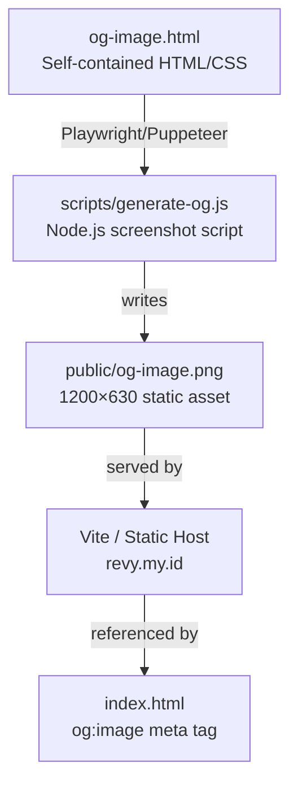

# Design Document: OG Image Generator

## Overview

Generate a static 1200×630px Open Graph image (`public/og-image.png`) for Revy's portfolio website at `https://revy.my.id`. The image is built as a self-contained HTML file (`public/og-image.html`) styled with Material You (M3) design language, then screenshotted to PNG via a Node.js script using Playwright or Puppeteer. This ensures the OG image is visually consistent with the portfolio's existing M3 design system.

The generator is a one-time (or on-demand) build-time tool — it does not run at runtime. The output PNG is committed to `public/og-image.png` and served as a static asset, matching the existing `<meta property="og:image">` tag already present in `index.html`.

---

## Architecture



The pipeline is intentionally simple: one HTML source → one script → one PNG output. No build pipeline integration is required unless the developer wants to automate it.

---

## High-Level Layout

```
┌─────────────────────────────────────────────────────────────────────┐  1200px
│  [BG: M3 surface #FFFBFE + subtle radial gradient blobs]            │
│                                                                     │
│   ┌─────────────────────────────────────────────────────────────┐   │
│   │  CARD (surface-container, elevation-2, border-radius 28px)  │   │
│   │                                                             │   │
│   │   Revy                          [decorative blob top-right] │   │
│   │   Display Large · #1C1B1F                                   │   │
│   │                                                             │   │
│   │   Full-Stack Software Engineer                              │   │
│   │   Headline Medium · #49454F                                 │   │
│   │                                                             │   │
│   │   [📍 Jambi, Indonesia]  ← M3 Assist Chip                  │   │
│   │                                                             │   │
│   │   [JS] [React] [Python] [Git] [CI/CD]                       │   │
│   │   [Node.js] [Docker] [MongoDB] [TypeScript]                 │   │
│   │   ← M3 Suggestion Chips (tonal, pill shape)                 │   │
│   │                                                             │   │
│   │   revy.my.id  ← Body Large · primary #6750A4               │   │
│   └─────────────────────────────────────────────────────────────┘   │
│                                                                     │
└─────────────────────────────────────────────────────────────────────┘  630px
```

---

## Color System (Material You — Light Scheme)

| Token | Hex | Usage |
|---|---|---|
| `primary` | `#6750A4` | Name text accent, URL text, chip borders |
| `on-primary` | `#FFFFFF` | Text on primary-colored surfaces |
| `primary-container` | `#EADDFF` | Skill chip background |
| `on-primary-container` | `#21005D` | Skill chip text |
| `surface` | `#FFFBFE` | Page background |
| `surface-container` | `#F3EDF7` | Card background |
| `surface-container-high` | `#ECE6F0` | Elevated card / chip hover |
| `on-surface` | `#1C1B1F` | Primary text (name) |
| `on-surface-variant` | `#49454F` | Secondary text (job title) |
| `outline-variant` | `#CAC4D0` | Chip borders, dividers |
| `secondary-container` | `#E8DEF8` | Location chip background |
| `on-secondary-container` | `#1D192B` | Location chip text |

Background blobs use `primary-container` (`#EADDFF`) and `secondary-container` (`#E8DEF8`) at 40–60% opacity.

---

## Typography

| Role | Font | Size | Weight | Usage |
|---|---|---|---|---|
| Display Large | Google Sans / Inter | 57px | 400 | "Revy" name |
| Headline Medium | Google Sans / Inter | 28px | 400 | Job title |
| Label Large | Google Sans / Inter | 14px | 500 | Skill chips |
| Label Medium | Google Sans / Inter | 12px | 500 | Location chip |
| Body Large | Google Sans / Inter | 16px | 400 | URL |

Font stack: `'Google Sans', 'Inter', system-ui, sans-serif` — loaded via Google Fonts CDN in the HTML file.

---

## Components and Interfaces

### Component 1: Background Layer

**Purpose**: Full-canvas M3 surface with decorative blobs

**Structure**:
```html
<div class="bg">
  <div class="blob blob-1"></div>  <!-- top-right, primary-container -->
  <div class="blob blob-2"></div>  <!-- bottom-left, secondary-container -->
  <div class="blob blob-3"></div>  <!-- center-right, tertiary-container -->
</div>
```

**Specs**:
- Canvas: `1200 × 630px`, `background: #FFFBFE`
- Blob 1: `400×400px`, `border-radius: 50%`, `background: radial-gradient(#EADDFF, transparent)`, positioned `top: -100px; right: -80px`, `opacity: 0.7`
- Blob 2: `350×350px`, same shape, `background: radial-gradient(#E8DEF8, transparent)`, `bottom: -80px; left: -60px`, `opacity: 0.6`
- Blob 3: `250×250px`, `background: radial-gradient(#D0BCFF, transparent)`, `top: 50%; right: 200px`, `opacity: 0.4`

### Component 2: Main Card

**Purpose**: Elevated M3 surface container holding all content

**Specs**:
- `background: #F3EDF7`
- `border-radius: 28px` (M3 extra-large shape)
- `box-shadow: 0px 1px 2px rgba(0,0,0,0.3), 0px 2px 6px 2px rgba(0,0,0,0.15)` (elevation-2)
- `padding: 56px 64px`
- `width: 1040px`, centered horizontally
- `min-height: 490px`

### Component 3: Name Display

**Purpose**: Primary identity — "Revy" in Display Large

**Specs**:
- Text: `Revy`
- `font-size: 72px` (scaled up from M3 Display Large for visual impact at 1200px)
- `font-weight: 400`
- `color: #1C1B1F`
- `letter-spacing: -1px`
- `line-height: 1.1`
- Optional: subtle `background: linear-gradient(135deg, #1C1B1F 60%, #6750A4)` with `-webkit-background-clip: text` for a tonal accent

### Component 4: Job Title

**Purpose**: Secondary identity line

**Specs**:
- Text: `Full-Stack Software Engineer`
- `font-size: 28px`
- `font-weight: 400`
- `color: #49454F`
- `margin-top: 8px`

### Component 5: Location Chip

**Purpose**: M3 Assist Chip showing location

**Specs**:
- Text: `📍 Jambi, Indonesia`
- `background: #E8DEF8`
- `color: #1D192B`
- `border-radius: 9999px` (pill)
- `padding: 6px 16px`
- `font-size: 14px`, `font-weight: 500`
- `border: 1px solid #CAC4D0`
- `margin-top: 20px`
- `display: inline-flex`, `align-items: center`, `gap: 6px`

### Component 6: Skill Chips Row

**Purpose**: M3 Suggestion Chips for tech skills

**Specs**:
- Container: `display: flex; flex-wrap: wrap; gap: 10px; margin-top: 28px`
- Each chip:
  - `background: #EADDFF`
  - `color: #21005D`
  - `border-radius: 9999px`
  - `padding: 6px 16px`
  - `font-size: 13px`, `font-weight: 500`
  - `border: 1px solid #D0BCFF`
- Skills: `JavaScript`, `React`, `Python`, `Git`, `CI/CD`, `Node.js`, `Docker`, `MongoDB`, `TypeScript`

### Component 7: URL Footer

**Purpose**: Brand URL at bottom of card

**Specs**:
- Text: `revy.my.id`
- `font-size: 16px`
- `font-weight: 500`
- `color: #6750A4`
- `margin-top: auto` (pushed to bottom of card via flex column)
- `letter-spacing: 0.5px`

---

## Data Models

### OG Image Content

```typescript
interface OGImageContent {
  name: string;           // "Revy"
  title: string;          // "Full-Stack Software Engineer"
  location: string;       // "Jambi, Indonesia"
  skills: string[];       // ["JavaScript", "React", ...]
  url: string;            // "revy.my.id"
  dimensions: {
    width: 1200;
    height: 630;
  };
}
```

### Screenshot Script Config

```typescript
interface ScreenshotConfig {
  inputPath: string;    // "public/og-image.html"
  outputPath: string;   // "public/og-image.png"
  viewport: {
    width: 1200;
    height: 630;
    deviceScaleFactor: 2;  // 2x for retina-quality output
  };
  waitUntil: "networkidle";  // ensure fonts loaded
}
```

---

## Low-Level Design: HTML/CSS Structure

### File: `public/og-image.html`

```html
<!DOCTYPE html>
<html lang="en">
<head>
  <meta charset="UTF-8" />
  <meta name="viewport" content="width=1200" />
  <link rel="preconnect" href="https://fonts.googleapis.com" />
  <link href="https://fonts.googleapis.com/css2?family=Google+Sans:wght@400;500&display=swap" rel="stylesheet" />
  <style>
    /* Reset */
    *, *::before, *::after { box-sizing: border-box; margin: 0; padding: 0; }

    /* Canvas */
    body {
      width: 1200px;
      height: 630px;
      overflow: hidden;
      background: #FFFBFE;
      font-family: 'Google Sans', 'Inter', system-ui, sans-serif;
      position: relative;
    }

    /* Background blobs */
    .blob {
      position: absolute;
      border-radius: 50%;
      filter: blur(60px);
      pointer-events: none;
    }
    .blob-1 {
      width: 420px; height: 420px;
      background: radial-gradient(circle, #EADDFF 0%, transparent 70%);
      top: -120px; right: -80px;
      opacity: 0.75;
    }
    .blob-2 {
      width: 360px; height: 360px;
      background: radial-gradient(circle, #E8DEF8 0%, transparent 70%);
      bottom: -90px; left: -60px;
      opacity: 0.65;
    }
    .blob-3 {
      width: 260px; height: 260px;
      background: radial-gradient(circle, #D0BCFF 0%, transparent 70%);
      top: 200px; right: 220px;
      opacity: 0.4;
    }

    /* Card */
    .card {
      position: absolute;
      top: 50%; left: 50%;
      transform: translate(-50%, -50%);
      width: 1080px;
      min-height: 510px;
      background: #F3EDF7;
      border-radius: 28px;
      box-shadow: 0px 1px 2px rgba(0,0,0,0.3), 0px 2px 6px 2px rgba(0,0,0,0.15);
      padding: 52px 64px;
      display: flex;
      flex-direction: column;
      justify-content: space-between;
    }

    /* Name */
    .name {
      font-size: 76px;
      font-weight: 400;
      letter-spacing: -1.5px;
      line-height: 1.05;
      background: linear-gradient(135deg, #1C1B1F 55%, #6750A4 100%);
      -webkit-background-clip: text;
      -webkit-text-fill-color: transparent;
      background-clip: text;
    }

    /* Job title */
    .title {
      font-size: 28px;
      font-weight: 400;
      color: #49454F;
      margin-top: 10px;
      letter-spacing: 0.1px;
    }

    /* Location chip */
    .location-chip {
      display: inline-flex;
      align-items: center;
      gap: 6px;
      background: #E8DEF8;
      color: #1D192B;
      border: 1px solid #CAC4D0;
      border-radius: 9999px;
      padding: 6px 18px;
      font-size: 14px;
      font-weight: 500;
      margin-top: 20px;
      width: fit-content;
    }

    /* Skills */
    .skills {
      display: flex;
      flex-wrap: wrap;
      gap: 10px;
      margin-top: 28px;
    }
    .skill-chip {
      background: #EADDFF;
      color: #21005D;
      border: 1px solid #D0BCFF;
      border-radius: 9999px;
      padding: 6px 18px;
      font-size: 13px;
      font-weight: 500;
      letter-spacing: 0.1px;
    }

    /* URL */
    .url {
      font-size: 16px;
      font-weight: 500;
      color: #6750A4;
      letter-spacing: 0.5px;
      margin-top: 32px;
    }
  </style>
</head>
<body>
  <!-- Background blobs -->
  <div class="blob blob-1"></div>
  <div class="blob blob-2"></div>
  <div class="blob blob-3"></div>

  <!-- Main card -->
  <div class="card">
    <div>
      <div class="name">Revy</div>
      <div class="title">Full-Stack Software Engineer</div>
      <div class="location-chip">📍 Jambi, Indonesia</div>
      <div class="skills">
        <span class="skill-chip">JavaScript</span>
        <span class="skill-chip">React</span>
        <span class="skill-chip">Python</span>
        <span class="skill-chip">Git</span>
        <span class="skill-chip">CI/CD</span>
        <span class="skill-chip">Node.js</span>
        <span class="skill-chip">Docker</span>
        <span class="skill-chip">MongoDB</span>
        <span class="skill-chip">TypeScript</span>
      </div>
    </div>
    <div class="url">revy.my.id</div>
  </div>
</body>
</html>
```

### File: `scripts/generate-og.js`

```javascript
// Node.js script — run with: node scripts/generate-og.js
// Requires: npm install -D playwright (or puppeteer)

import { chromium } from 'playwright';
import { fileURLToPath } from 'url';
import path from 'path';

const __dirname = path.dirname(fileURLToPath(import.meta.url));
const INPUT  = path.resolve(__dirname, '../public/og-image.html');
const OUTPUT = path.resolve(__dirname, '../public/og-image.png');

const browser = await chromium.launch();
const page    = await browser.newPage();

await page.setViewportSize({ width: 1200, height: 630 });
await page.goto(`file://${INPUT}`, { waitUntil: 'networkidle' });

await page.screenshot({
  path: OUTPUT,
  clip: { x: 0, y: 0, width: 1200, height: 630 },
});

await browser.close();
console.log(`✅  OG image written to ${OUTPUT}`);
```

---

## Error Handling

| Scenario | Handling |
|---|---|
| Google Fonts CDN unavailable | Font stack falls back to `Inter` → `system-ui` → `sans-serif`; layout unaffected |
| Playwright not installed | Script exits with clear error; developer runs `npm install -D playwright` |
| Output directory missing | Script should `fs.mkdirSync` the output dir before writing |
| Screenshot clip mismatch | Viewport is set to exactly 1200×630 before screenshot; clip matches viewport |

---

## Testing Strategy

### Visual Verification (Manual)
- Open `public/og-image.html` in a browser at 1200×630 viewport and visually inspect layout
- Validate against the layout diagram in this document

### Automated Screenshot Test
- Run `node scripts/generate-og.js` and verify `public/og-image.png` is created
- Check image dimensions: must be exactly 1200×630px
- Use an OG debugger (e.g., [opengraph.xyz](https://www.opengraph.xyz) or Facebook Sharing Debugger) to validate the deployed image

### Property-Based Correctness Properties
1. The output PNG dimensions are always exactly 1200×630px
2. The HTML file is self-contained — no external JS dependencies, only a Google Fonts CSS link
3. All skill chips from `portfolio-data.ts` are present in the HTML
4. The URL text matches the canonical URL in `index.html`
5. Color values in the HTML match the M3 light scheme tokens defined in `tailwind.config.js`

---

## Performance Considerations

- The HTML file is static and self-contained — no JavaScript execution needed at render time
- `deviceScaleFactor: 2` in the screenshot script produces a 2400×1260 internal render, downsampled to 1200×630 for crisp output; adjust to `1` if file size is a concern
- Google Fonts is loaded with `display=swap` to prevent render blocking during screenshot

---

## Security Considerations

- The HTML file contains no user-supplied input — all content is hardcoded from `portfolio-data.ts`
- The screenshot script runs locally at build time; no server-side execution or user input involved
- No secrets or environment variables are used

---

## Dependencies

| Dependency | Purpose | Install |
|---|---|---|
| `playwright` (dev) | Headless Chromium for screenshot | `npm install -D playwright` |
| Google Fonts CDN | `Google Sans` font in HTML | CDN link in `<head>` |

Alternatively, `puppeteer` can be used in place of Playwright with minimal script changes (`puppeteer.launch()`, `page.goto()`, `page.screenshot()` — same API surface).
